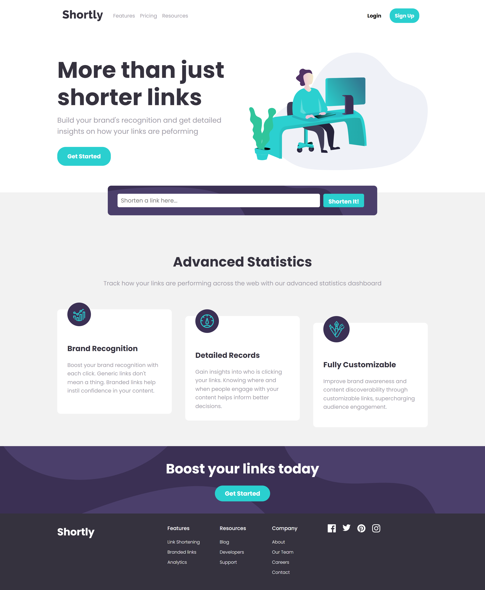
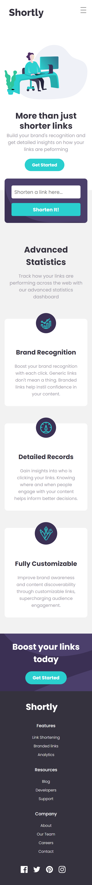

# Frontend Mentor - Shortly URL shortening API Challenge solution(with ReactJS)

This is a solution to the [Shortly URL shortening API Challenge challenge on Frontend Mentor](https://www.frontendmentor.io/challenges/url-shortening-api-landing-page-2ce3ob-G). Frontend Mentor challenges help you improve your coding skills by building realistic projects. 

## Table of contents

- [Overview](#overview)
  - [The challenge](#the-challenge)
  - [Screenshot](#screenshot)
  - [Links](#links)
- [My process](#my-process)
  - [Built with](#built-with)
  - [What I learned](#what-i-learned)

  
## Overview

This project generates shortened URL's from any provided URL as long as it's valid. If the URL is invalid, an error message is displayed.

### The challenge

Users should be able to:

- View the optimal layout for the site depending on their device's screen size
- Shorten any valid URL
- See a list of their shortened links, even after refreshing the browser
- Copy the shortened link to their clipboard in a single click
- Receive an error message when the `form` is submitted if:
  - The `input` field is empty

### Screenshots

### Links

- Solution URL: [Code on GitHub](https://github.com/ikennaezef/url-shortener)
- Live Site URL: (https://ikennaezef.github.io/url-shortener/)

## My process

### Built with

- Semantic HTML5 markup
- CSS custom properties
- Flexbox
- CSS Grid
- Mobile-first workflow
- React - A JavaScript Library

### What I learned

On this challenge, I got to improve my knowledge on the React Library, react component props and some React Hooks. I also learnt how to implement responsiveness with React(working with nav menus and resizing etc.). I also learnt more about error handling.
